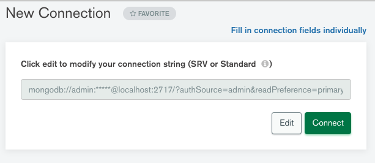
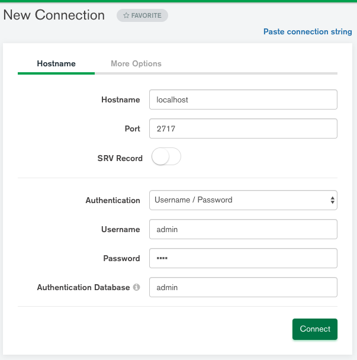

# Database Documentation
We will be using mongodb with docker to provide environment encapsulation
so that the db can be deployed in any environment.

you will need docker pre-installed on your computer before u can proceed.

###### MongoDB version used
- version used: 5.0.4

command to pull from docker repository
```bash
docker pull mongo:5.0.4
```

## Getting Started (the TLDR version of it)
How to get started using the database

1. ensure docker is installed on your computer
2. open a terminal in the current directory
3. run this command in this current directory
```bash
docker-compose up
```
Thats it, 3 steps to get started using this mongo_db

## shutdown the db_server
```bash
docker-compose down
```

## for viewing of DB using GUI (optional)
- download MongoDB Compass
- click on "Fill in connection fields Individually"

- then fill the details accordingly, get the credentials from the docker-compose.yml

- you have connected successfully

## for viewing of DB using CLI (optional)
mongosh localhost:2717
